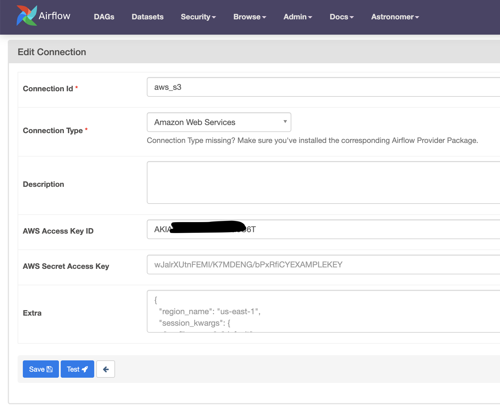

## Passing Data Between Tasks with the KubernetesPodOperator in Apache Airflow

This repo is the code that goes with [this article](https://medium.com/p/7ae9e3e6675c/edit) that discuses how to pass data between tasks with the KubernetesPodOperator in Apache Airflow. 

There are some requirements you need to implement to get this running.

### Run a Local Airflow Deployment
For this step you will need an Airflow instance to work with. One easiest way is to do this localling using the Astronomer [astro cli](https://docs.astronomer.io/astro/cli/overview) installed along with some form of Docker engine (e.g. Docker Desktop). Clone this project into local folder and open that folder. 

#### Copy `aws` cli and `kubectl` Config Details
From here you need to add your kubernetes authentication details. Copy your aws credential files (`config` + `credentials`) into the `include/.aws/` directory. These files are usually in `~/.aws/`. You may have several sets of credentials, so you can delete the ones you don't need before copying over.
```
$ tree ~/.aws/
/Users/jeff/.aws/
├── config
└── credentials
0 directories, 2 files
```

You also need to copy the `KUBECONFIG` file for the cluster ino the `include/` directory. The is usually located at `~/.kube/config`. Again you may have multiple cluster contexts in that file, so you can delete the ones you don't need before copying over.

These files will be copied into the Docker image used for the local deployment and are *not* pushed to the git repo, so the credentials will remain _relatively_ safe.

#### Add the source Data File to your S3 Bucket
The source data for this project is available for download [here](https://jf-ml-data.s3.eu-central-1.amazonaws.com/all_flight_data.parquet). Download the `all_flight_data.parquet` file and upload to an S3 bucket that you have access to. You need to add the bucket name as an environment variable in the next step.

#### Update the `Dockerfile`
Next open the `Dockerfile` file and update the `CLUSTER_CONTEXT` and `BUCKET_NAME` environment variables with the details specific to the cluster you will be interacting with and the S3 bucket you will be using.

```Dockerfile
ENV CLUSTER_CONTEXT=[your cluster context] \
BUCKET_NAME=[your bucket name]
```

Once you've updated the Dockerfile and added your credentials to the project, you can start up the local Airflow UI but running `astro dev start` in the project directory. This will bring up an Airflow instance your you local machine that you can connect to on http://localhost:8080/.

#### Create an AWS Connection
For the KPO pod to read and write data from S3, it will require AWS connection credentials. Therefore you need to add your AWS connection details to Airflow. This is different to the AWS config file from a previous step, although it does contain the same info. In the Airflow UI, got to `Admin > Connections` and add a new `Amazon Web Services` connection. Fill in your AWS details as follows, make sure to use the same `aws_s3` connection ID.



#### Trigger the DAG
If you have completed all the previous steps, you should be good to go. Trigger the DAG in the local Airflow UI and marvel at how the KPO operates a pod!
